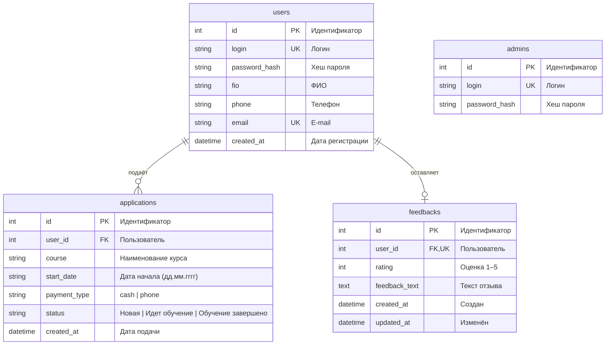

# ER-диаграмма базы данных — «Корочки.есть»

Схема соответствует файлу `db.js` (SQLite, `data/korochki.db`).

## Диаграмма (Mermaid)

Скопируйте блок ниже на https://mermaid.live — получите PNG/SVG для отчёта.

> **admins** — отдельная сущность, с `users` не связана (вход администратора отдельно).

## Связи (для пояснительной записки)

| Связь | Тип | Пояснение |
|-------|-----|-----------|
| users → applications | 1 : N | Один пользователь может подать много заявок |
| users → feedbacks | 1 : 0..1 | У пользователя не больше одного отзыва (`UNIQUE user_id`) |
| users ← applications | N : 1 | Каждая заявка принадлежит одному пользователю |
| users ← feedbacks | 0..1 : 1 | Отзыв всегда привязан к одному пользователю |

При удалении пользователя заявки и отзыв удаляются каскадно (`ON DELETE CASCADE`).

## Сущности и атрибуты

### users (Пользователь)
- Регистрация на портале
- Уникальные: `login`, `email`

### applications (Заявка на обучение)
- Курс, желаемая дата, способ оплаты, статус обработки

### feedbacks (Отзыв)
- Оценка качества услуг и текст (один отзыв на пользователя)

### admins (Администратор)
- Управление статусами заявок (отдельная таблица, не наследник users)

## Как получить картинку для задания

### Вариант 1 — Mermaid Live (быстро)
1. Откройте https://mermaid.live  
2. Вставьте код из блока `mermaid` выше  
3. **Actions → Export PNG** или **SVG**

### Вариант 2 — draw.io (diagrams.net)
1. https://app.diagrams.net  
2. **Arrange → Insert → Advanced → Mermaid** (или нарисуйте прямоугольники вручную по таблицам выше)

### Вариант 3 — dbdiagram.io
1. https://dbdiagram.io  
2. Вставьте код из файла `ER-dbdiagram.dbml` в этой папке  
3. **Export → PNG / PDF**

### Вариант 4 — VS Code / Cursor
Расширение **Markdown Preview Mermaid Support** → откройте этот файл → предпросмотр → скриншот.
